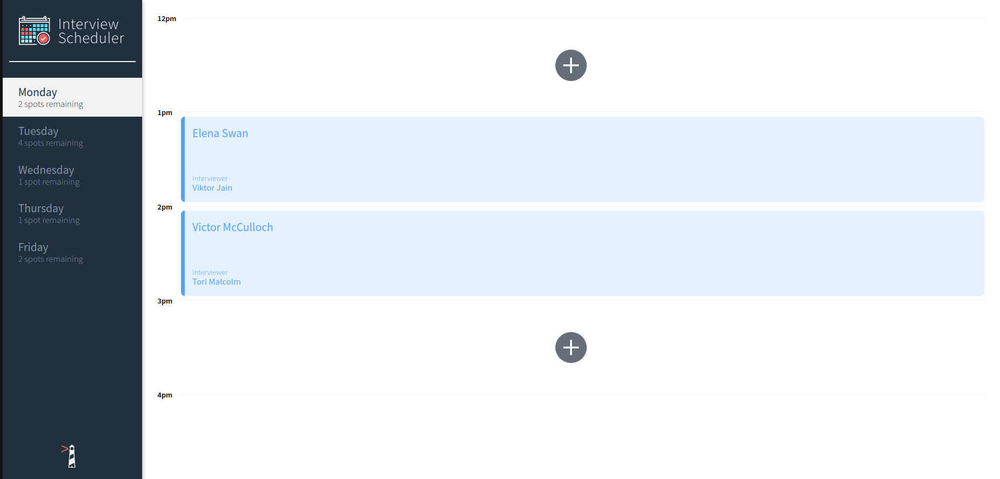
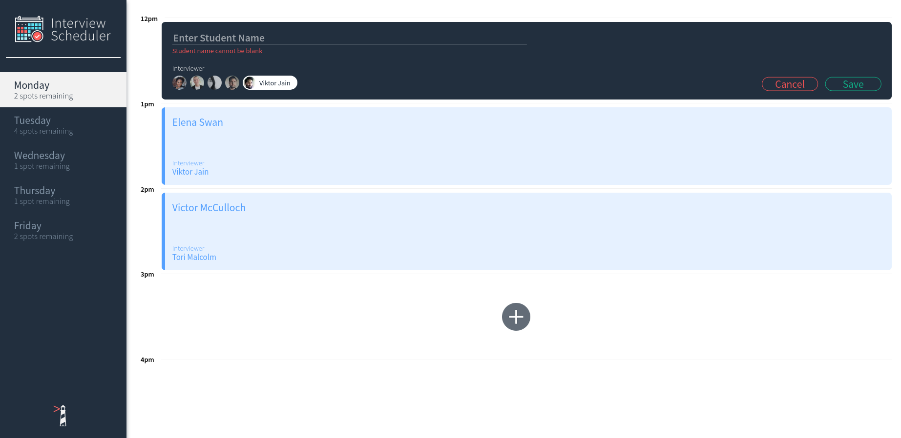

# Interview Scheduler

The application that allows users to book and cancel interviews.

Made with 💖 and React, Axios, Cypress, Storybook, HTML, CSS, JS, Node, Jest, Postgre database.

## Getting Started

1. Clone your repository onto your local device.
2. Install dependencies using the `npm install` command.
3. Start Web API server from https://github.com/lighthouse-labs/scheduler-api
4. Start the web server using the `npm run start` command. The app will be served at <http://localhost:8000/>.
5. Open <http://localhost:8000/> in your browser.





## Running Webpack Development Server

```sh
npm start
```

## Running Jest Test Framework

```sh
npm test
```

## Running Storybook Visual Testbed

```sh
npm run storybook
```
